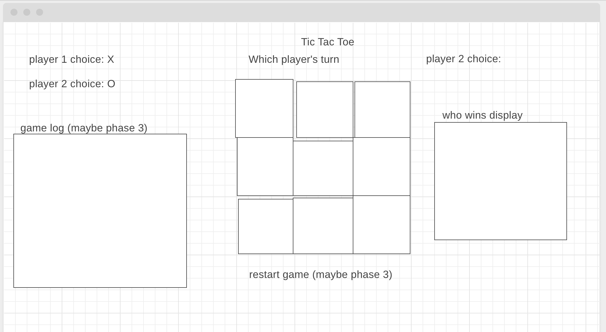

**PROJECT:** Tic Tac Toe
---

##Description:##
This is a tic-tac-toe game playable by 2 people on the same browser/device. Players take turns placing their character in a 3x3 square grid until a player gets 3
of their pieces in a row horizontally, vertically, or diagonally.
---

**Technologies Used (Installation):**
- Wireframe.cc - website used to construct a wireframe
- IntelliJ - IDE software used to build game, needs installation
- GitHub - browser based portfolio, need account created
- Git - for version control and pushing to GitHub
- Javascript - scripting functionality of the game
- HTML/CSS - styling the visuals of the game and script accessing DOM elements
- Audio files - Needs downloading/importing
---

WIREFRAME

---

**Approach:**

I used a Wireframe first to flesh out some initial design ideas. Then I started with HTML
and built the main grid for the game. Then I used javascript to access the squares and add EventListeners
to respond to user clicks.I prioritized game functionality first and left visuals for later.
I knew the win conditions was going to be the toughest part, so I tackled that first. I thought if
I could get the win conditions working, then I can just pass in the user choices.
After the game functionality was completed, I went back to the html and css to brush up the visuals.
---

**TTT Version 1 - Unsolved Problems/Future Enhancements**
- Not mobile platform friendly so I plan to incorporate that in future versions
- Does not handle window resizing well, so need to update CSS to take that into account
- Would like to add in the following features down the road:
  1. Animations for when user selects a square
  2. A game history log displayed at the side
  3. Mobile platform capability
  4. Multiplayer option across other devices
    
---
Link To Game:
[Shaheer's Tic Tac Toe Game](https://sahmed7.github.io/TicTacToe/)